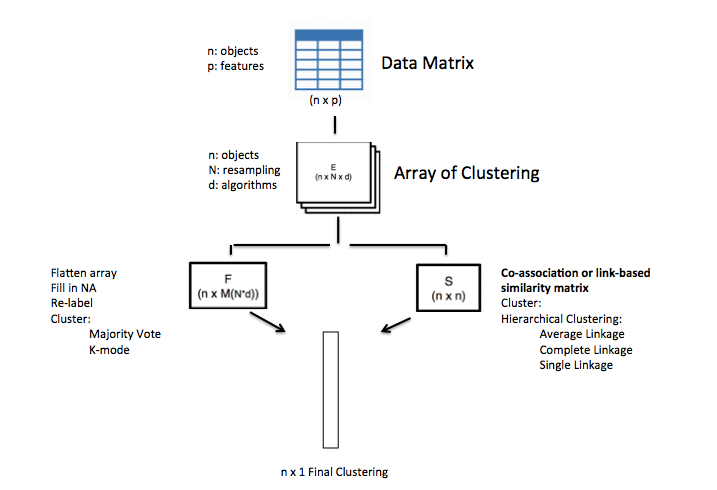

<!-- README.md is generated from README.Rmd. Please edit that file -->

```{r, echo=FALSE}
knitr::opts_chunk$set(
  collapse = TRUE,
  comment = "#>",
  fig.path = "README-"
)
```

# diceR

[](https://travis-ci.org/AlineTalhouk/diceR)
[](https://ci.appveyor.com/project/dchiu911/diceR)
[](https://codecov.io/gh/AlineTalhouk/diceR?branch=master)

The goal of `diceR` is to provide a semi-automated framework for generating diverse cluster ensembles in R. There are a lot of nuances in cluster analysis to consider, including cluster size, choice of algorithm, and how to handle missing values. We implemented a wrapper function `dice()` that allows the user to obtain results without meddling over statistical details.

## Installation

You can install `diceR` from GitHub with:

```{r install, message=FALSE, eval=FALSE}
# install.packages("devtools")
devtools::install_github("AlineTalhouk/diceR")
```

## Example

The following example shows how to use the main function of the package, `dice()`. A data matrix `hgsc` contains samples as rows, features as columns. It is partitioned into (a range of) `nk` clusters over `reps` bootstrap subsamples using each of the clustering `algorithms`. Clustering assignments are aggregated by the `cons.funs`.

```{r example, results='hide'}
library(diceR)
data(hgsc)
obj <- dice(hgsc, nk = 4, reps = 5, algorithms = c("hc", "diana"),
            cons.funs = c("kmodes", "majority"))
```

The first few cluster assignments are shown below:

```{r assignments}
knitr::kable(head(obj$clusters))
```

You can also compare the base `algorithms` with the `cons.funs` using internal evaluation indices:

```{r compare}
knitr::kable(obj$indices$internal$`4`)
```

## Pipeline

This figure is a visual schematic of the pipeline that `dice()` implements.


