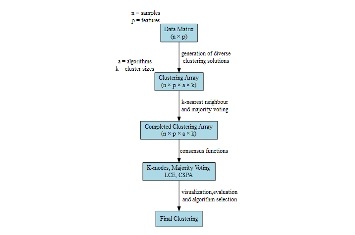

<!-- README.md is generated from README.Rmd. Please edit that file -->

```{r, echo = FALSE}
knitr::opts_chunk$set(
  collapse = TRUE,
  comment = "#>",
  fig.path = "README-"
)
```

# diceR

[](https://travis-ci.com/AlineTalhouk/diceR)
[](https://codecov.io/gh/AlineTalhouk/diceR?branch=master)

The goal of `diceR` is to provide pipelines for generating diverse cluster ensembles in R.

## Installation

You can install `diceR` from github with:

```{r}
# install.packages("devtools")
# devtools::install_github("AlineTalhouk/diceR")
```

## Example

This basic example shows you how to use the main function of the package, `dice()`. A data matrix `dat` is partitioned into (a range of) `nk` clusters over `reps` bootstrap subsamples using each of the clustering `algorithms`. Clustering assignments are aggregated by the `cons.funs`.

```{r, results='hide'}
library(diceR)
data(hgsc)
dat <- t(hgsc[, -1])
obj <- dice(dat, nk = 4, reps = 5, algorithms = c("hc", "diana"),
            cons.funs = c("kmodes", "majority"))
```

The first few cluster assignments are shown below:

```{r}
knitr::kable(head(obj$clusters))
```

You can also compare the base `algorithms` with the `cons.funs` using internal evaluation indices:

```{r}
knitr::kable(obj$indices$internal$`4`)
```

## Pipeline

This figure is a visual schematic of the pipeline that `dice()` implements.


