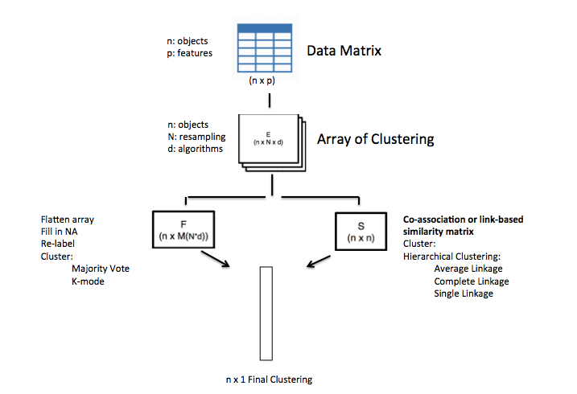

<!-- README.md is generated from README.Rmd. Please edit that file -->
diceR
=====

[](https://travis-ci.com/AlineTalhouk/diceR) [](https://codecov.io/gh/AlineTalhouk/diceR?branch=master)

The goal of `diceR` is to provide pipelines for generating diverse cluster ensembles in R.

Installation
------------

You can install `diceR` from github with:

``` r
# install.packages("devtools")
# devtools::install_github("AlineTalhouk/diceR")
```

Example
-------

This basic example shows you how to use the main function of the package, `dice()`. A data matrix `dat` is partitioned into (a range of) `nk` clusters over `reps` bootstrap subsamples using each of the clustering `algorithms`. Clustering assignments are aggregated by the `cons.funs`.

``` r
library(diceR)
data(hgsc)
dat <- t(hgsc[, -1])
obj <- dice(dat, nk = 4, reps = 5, algorithms = c("hc", "diana"),
            cons.funs = c("kmodes", "majority"))
```

The first few cluster assignments are shown below:

``` r
knitr::kable(head(obj$clusters))
```

|                      |  kmodes|  majority|
|----------------------|-------:|---------:|
| TCGA.04.1331\_PRO.C5 |       3|         3|
| TCGA.04.1332\_MES.C1 |       3|         3|
| TCGA.04.1336\_DIF.C4 |       1|         3|
| TCGA.04.1337\_MES.C1 |       3|         3|
| TCGA.04.1338\_MES.C1 |       3|         3|
| TCGA.04.1341\_PRO.C5 |       3|         3|

You can also compare the base `algorithms` with the `cons.funs` using internal evaluation indices:

``` r
knitr::kable(obj$indices$internal$`4`)
```

| Algorithms       |   c\_index|  calinski\_harabasz|  davies\_bouldin|       dunn|  mcclain\_rao|       pbm|    sd\_dis|  ray\_turi|        tau|      gamma|    g\_plus|  Compactness|  Connectivity|
|:-----------------|----------:|-------------------:|----------------:|----------:|-------------:|---------:|----------:|----------:|----------:|----------:|----------:|------------:|-------------:|
| HC\_Euclidean    |  0.2466140|            4.724811|         2.207399|  0.4315581|     0.7786802|  42.02530|  0.1108028|  1.4267645|  0.2219521|  0.7314687|  0.0123621|     24.84100|      28.56032|
| DIANA\_Euclidean |  0.1635526|           49.981284|         3.531413|  0.3345569|     0.8075430|  38.08753|  0.2147582|  2.7798827|  0.4263474|  0.6204408|  0.0896140|     22.13289|     251.09405|
| kmodes           |  0.2020221|           39.127460|         1.563373|  0.3352598|     0.8254116|  49.27019|  0.1046540|  1.1356906|  0.3907289|  0.5528538|  0.1116735|     22.66419|     148.61865|
| majority         |  0.2458043|            5.645220|         1.379460|  0.4315581|     0.7781939|  96.93674|  0.0948754|  0.8261741|  0.2221915|  0.7330421|  0.0122634|     24.70600|      24.35079|

Pipeline
--------

This figure is a visual schematic of the pipeline that `dice()` implements.


